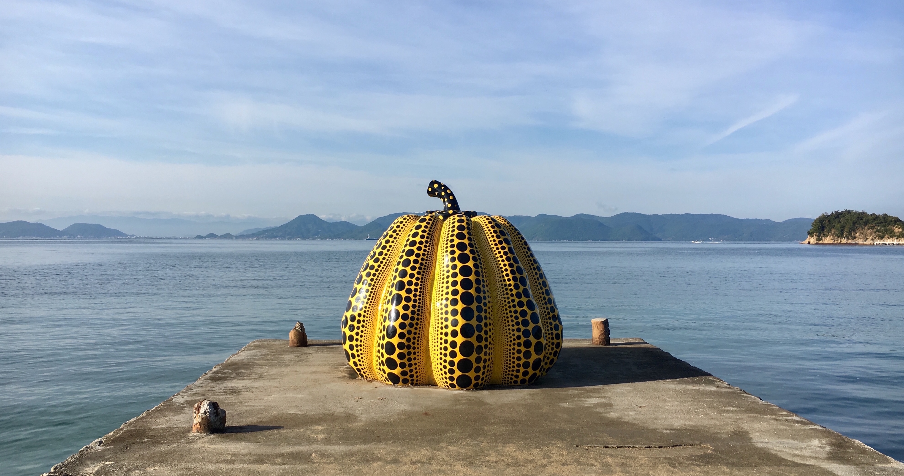

Welcome to my personal website! I am a current master's student in biostatistics at the Columbia University Mailman School of Public Health. This website was created as a part of P8105 Homework 4.

To learn more about me, feel free to take a look at my [resume](resume.html).

*The above photo is from Naoshima, a small Japanese island filled with lots of cool art. One of my favorite trips!*